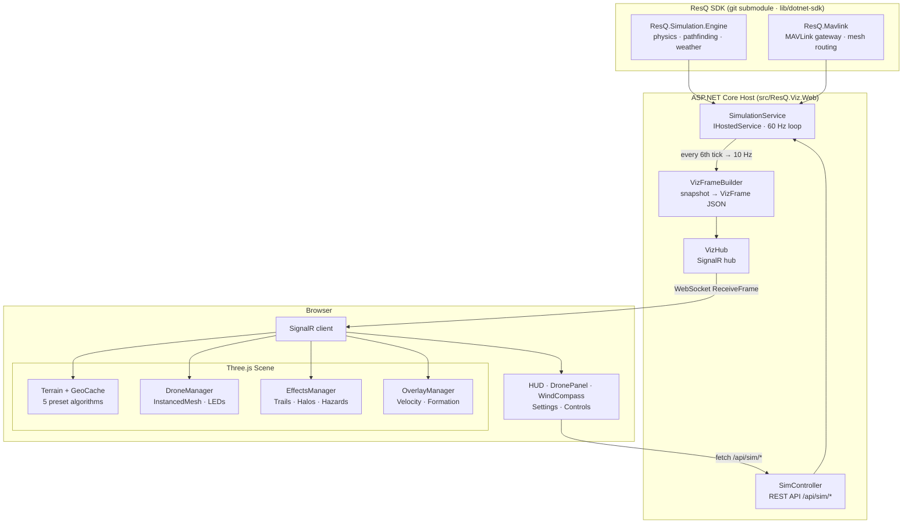
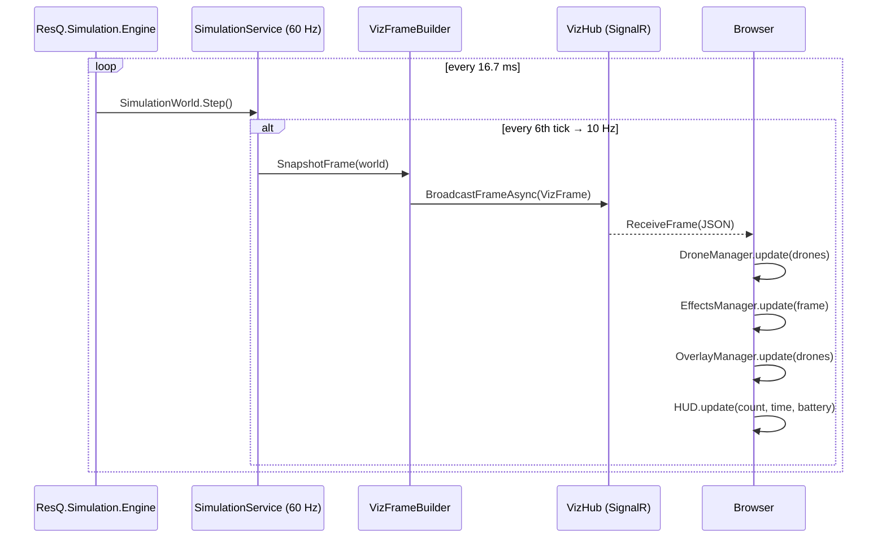
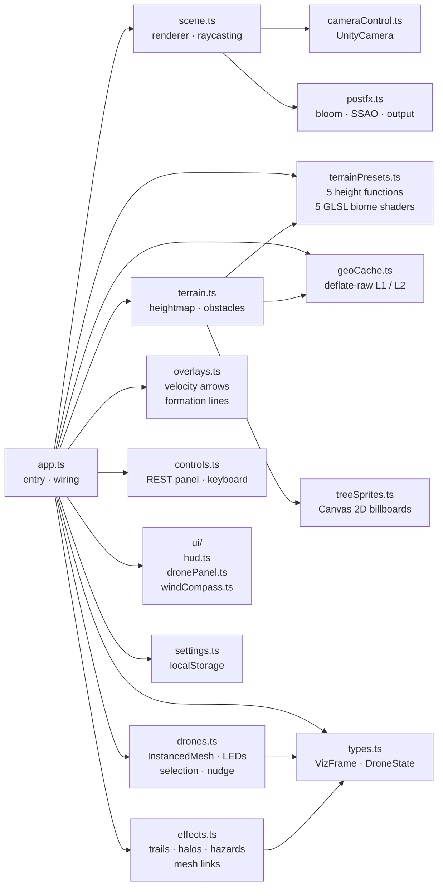
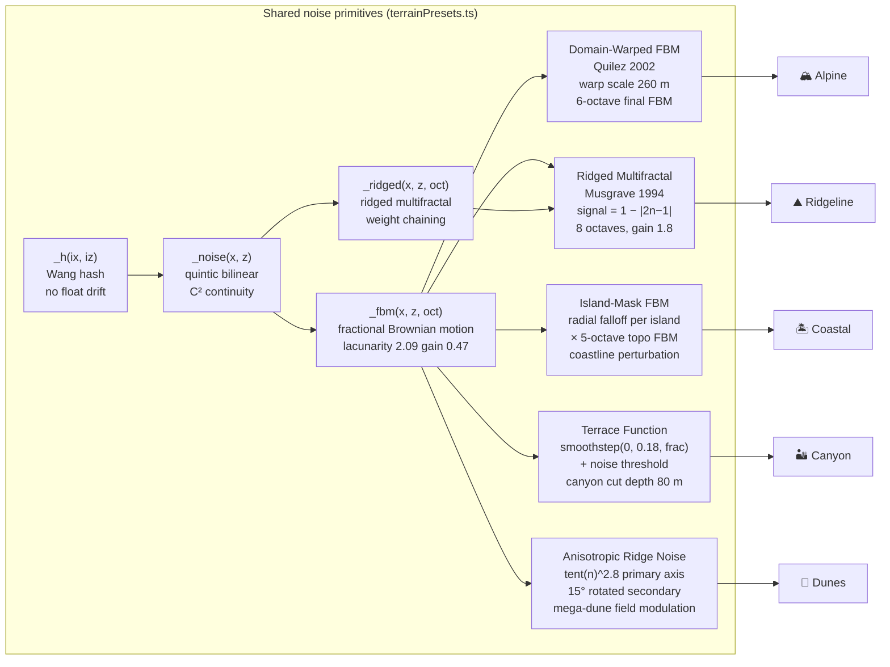
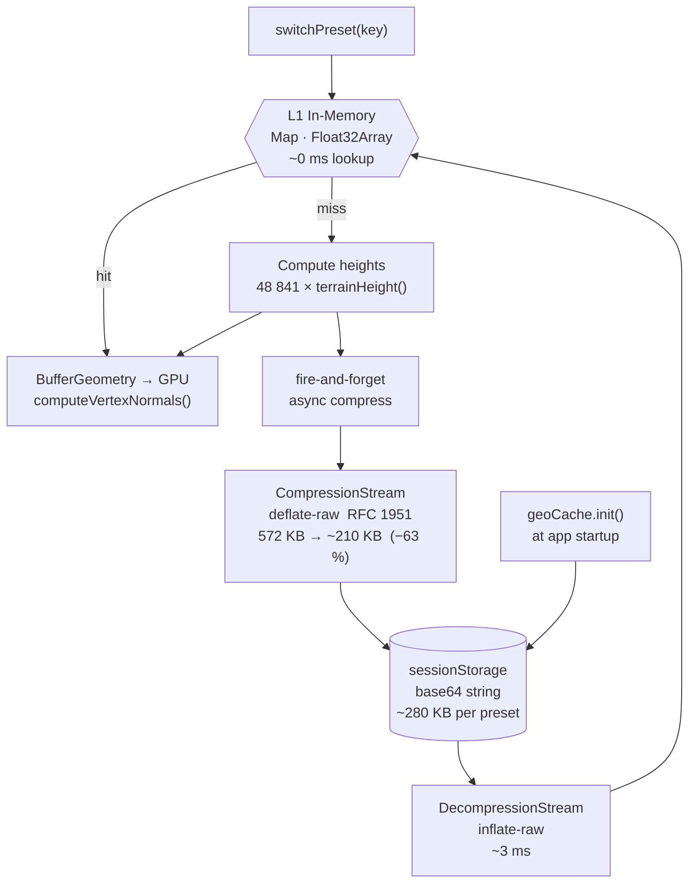

<!--
  Copyright 2026 ResQ Systems, Inc.

  Licensed under the Apache License, Version 2.0 (the "License");
  you may not use this file except in compliance with the License.
  You may obtain a copy of the License at

      http://www.apache.org/licenses/LICENSE-2.0

  Unless required by applicable law or agreed to in writing, software
  distributed under the License is distributed on an "AS IS" BASIS,
  WITHOUT WARRANTIES OR CONDITIONS OF ANY KIND, either express or implied.
  See the License for the specific language governing permissions and
  limitations under the License.
-->

# ResQ Viz — Live Coordination

**The common operating picture for autonomous disaster response.** Ten agencies show up to a hurricane with ten different drones; one shared air picture keeps them coordinated. ResQ Viz renders that picture in real time — mesh topology, hazard fusion, and decentralized consensus, streaming at 10 Hz into any browser.

- **For emergency managers running multi-agency SAR** — HURRICANE MELISSA scenario, 12 drones across 3 vendors, visible backhaul-loss → mesh-only degradation.
- **For integration partners** — vendor-tagged chassis per agency, MAVLink mesh simulation, SignalR streaming, REST control plane.
- **Live:** [viz.resq.software](https://viz.resq.software/)

Press `5` to load `multi-agency-sar`. Press `K` to kill the backhaul. Press `Ctrl+Shift+R` to enter investor-mode for a recorded demo.

---

## Features

- **Live telemetry** — SignalR WebSocket streaming at 10 Hz, ACES filmic tonemapping, PCF soft shadows
- **5 procedural terrain presets** — each backed by a distinct noise algorithm (domain-warped FBM, ridged multifractal, island-mask, terrace+canyon, anisotropic dunes)
- **Canvas-drawn tree billboard sprites** — 5-tier pine silhouettes and deciduous blobs rendered with Canvas 2D; 8 triangles per tree, two draw calls for the entire forest
- **Displaced boulder geometry** — per-vertex hash displacement on IcosahedronGeometry gives every rock a unique craggy profile
- **Geometry cache with deflate compression** — browser-native `CompressionStream` / `DecompressionStream` (RFC 1951); 572 KB → ~210 KB per preset (~63 % reduction); two-level L1/L2 cache survives page refresh via `sessionStorage`
- **Post-processing** — selective `UnrealBloomPass` (only emissive LEDs and nav lights glow), `SSAOPass` ambient occlusion, `OutputPass` tone mapping
- **Unity-style camera** — LMB orbit, RMB free-fly (WASD/QE/Shift), MMB pan, scroll zoom; collision prevention keeps the camera above terrain
- **Drone interaction** — click to select, WASD/QE to nudge in world space, click terrain to issue GoTo command, `F` to follow
- **Visual overlays** — position trails, altitude halos, velocity component arrows, mesh topology links, hazard zone discs, detection markers
- **Settings persistence** — bloom, fog density, FOV, fly speed, trail length, detection rings, battery warning threshold; stored in `localStorage`
- **WebGPU sensor primitive** — brick-map raymarcher voxelizes the heightfield at boot, then rebuilds when the terrain preset switches or a heightmap override is installed. It serves both **drone-pair line-of-sight** (mesh links visibly fade when terrain occludes them) and **per-drone LiDAR scans** (point clouds emanate from each drone, follow yaw/pitch/roll, optional mast/gimbal mount offsets). One compute kernel, two sensor consumers; ring-buffered async dispatch with `peakSlotDepth` / `raysOutsideWorld` audit counters; press `i` for the live stats overlay.
- **Lazy-loaded SignalR** — the SignalR runtime ships as a separate ~55 KB chunk and is fetched on first connect, keeping the main bundle below the 800 KiB CI budget

---

## Quick Start

```bash
git clone --recurse-submodules <repo>
cd viz/src/ResQ.Viz.Web
dotnet run                      # http://localhost:5000
```

`dotnet run` compiles the TypeScript frontend through Vite automatically via `Vite.AspNetCore` — no separate `npm run dev` is needed.

---

## System Architecture



---

## Real-Time Frame Pipeline



---

## Frontend Module Graph



---

## Terrain Engine

Five presets selectable at runtime from the sidebar. Each builds its own GLSL biome fragment shader, atmosphere (fog colour + density), obstacle distribution, and water level. Switching a preset disposes all Three.js objects and GPU resources, then rebuilds — using the geometry cache when available.

| Preset | Algorithm | Height range | Water level | Character |
|--------|-----------|-------------|-------------|-----------|
| 🏔 Alpine | Domain-warped FBM | −60 … +220 m | −3 m | Sweeping ridges, snow caps, 4 mountain peaks |
| ⛰ Ridgeline | Ridged multifractal | −15 … +210 m | −15 m | Knife-edge ridges, dense conifer valleys |
| 🏝 Coastal | Island-mask × FBM | −∞ … +90 m | +3 m | Tropical archipelago, sandy beaches |
| 🏜 Canyon | Terrace + canyon cuts | −80 … +85 m | −60 m | Sandstone mesas, deep gorge networks |
| 🌵 Dunes | Anisotropic ridge noise | −25 … +60 m | −25 m | Wind-driven barchan dune fields |



---

## Geometry Cache

Terrain vertex positions (572 KB per preset as `Float32Array`) are cached at two levels to make preset switches fast and page reloads instant.



Five presets cached: ~1.0 MB in `sessionStorage` vs 2.8 MB uncompressed. Compression ratio is logged to the browser console at runtime.

---

## Post-Processing Pipeline

Bloom is **selective**: a first composer pass blacks out all non-emissive objects so only drone LEDs, nav lights, and detection markers glow. A blend shader additively composites this onto the full scene render before the final `OutputPass` applies ACES filmic tone mapping and gamma correction.

```
RenderPass ──► UnrealBloomPass  ──► ShaderPass (blend)  ──► OutputPass
 (bloom          (emissive only)     base + bloom.rgb        ACES + gamma
  composer)

RenderPass ──► ShaderPass (blend)  ──► OutputPass
 (final          ↑ bloom texture        ACES + gamma
  composer)
```

---

## Project Layout

```
viz/
├── src/ResQ.Viz.Web/
│   ├── client/
│   │   ├── app.ts               Entry point — wires all modules together
│   │   ├── scene.ts             Three.js renderer, camera, post-processing, raycasting
│   │   ├── cameraControl.ts     Unity-style free-fly camera with terrain collision
│   │   ├── postfx.ts            Selective bloom pipeline (two EffectComposer passes)
│   │   │
│   │   ├── terrain.ts           Ground mesh, water, trees, rocks, buildings
│   │   ├── terrainPresets.ts    5 height functions + GLSL biome shaders + obstacle config
│   │   ├── treeSprites.ts       Canvas 2D tree textures + cross-billboard geometry
│   │   ├── geoCache.ts          deflate-raw geometry cache (CompressionStream / sessionStorage)
│   │   │
│   │   ├── drones.ts            Quadrotor InstancedMesh, PBR materials, LED status, selection
│   │   ├── effects.ts           Trails, hazard zone discs, detection markers, mesh links
│   │   ├── overlays.ts          Velocity arrows, altitude halos, formation lines
│   │   ├── controls.ts          Sidebar REST calls, scenario and command wiring
│   │   │
│   │   ├── settings.ts          User settings with localStorage persistence
│   │   ├── sensorStatsOverlay.ts  Bottom-left dev/audit overlay (`i` to toggle)
│   │   ├── types.ts             VizFrame · DroneState · HazardState · DetectionState
│   │   ├── dom.ts               Typed getEl<T>() helper
│   │   │
│   │   ├── webgpu/              WebGPU sensor primitive (brick-map raymarcher)
│   │   │   ├── device.ts          GPUDevice initialization with null-safe fallback
│   │   │   ├── sensors.ts         bootSensors() — wires world + LoS + LiDAR managers
│   │   │   ├── registry.ts        Singleton seam — getSensorContext() + LIDAR_MANAGER_CAPACITY
│   │   │   ├── world.ts           Heightfield → 128³ voxel cube + onTerrainChange rebuild
│   │   │   ├── brickmap.ts        Sparse top-grid + dense 8³ bricks (BRICK constant)
│   │   │   ├── los.ts             LosQueryManager — ring-buffered query() with LosQueryStats
│   │   │   ├── lidar.ts           LidarScan — quaternion-rotated scan pattern + mount offset
│   │   │   ├── rays.ts            Ray (48 B) / RayHit (32 B) wire format + flag constants
│   │   │   └── shaders/           build_brickmap.wgsl · march.wgsl · blit.wgsl
│   │   │
│   │   ├── __tests__/           Vitest smoke tests (rays packing, LidarScan validation)
│   │   │
│   │   └── ui/
│   │       ├── hud.ts           Top bar — connection, drone count, FPS, battery, selected chip
│   │       ├── dronePanel.ts    Drone detail panel — position, velocity, battery, commands
│   │       └── windCompass.ts   Canvas wind rose compass
│   │
│   ├── Controllers/             SimController — REST API
│   ├── Hubs/                    VizHub — SignalR frame broadcast
│   ├── Models/                  Request / response records
│   ├── Services/                SimulationService · VizFrameBuilder · ScenarioService
│   ├── styles/main.css          CSS custom properties, glassmorphism panels, HUD
│   └── wwwroot/                 Vite build output (gitignored; produced by `dotnet build` and uploaded as the `viz-wwwroot-{sha}` CI artifact for deploys)
│
├── tests/ResQ.Viz.Web.Tests/    xUnit + FluentAssertions + Moq
└── lib/dotnet-sdk/              Git submodule — ResQ .NET SDK
```

---

## REST API

| Method | Path | Body / Params | Description |
|--------|------|---------------|-------------|
| `POST` | `/api/sim/start` | — | Resume simulation |
| `POST` | `/api/sim/stop` | — | Pause simulation |
| `POST` | `/api/sim/reset` | — | Clear all drones |
| `POST` | `/api/sim/drone` | `{ position: [x,y,z] }` | Spawn a drone |
| `POST` | `/api/sim/drone/{id}/cmd` | `{ type, target? }` | Send flight command |
| `POST` | `/api/sim/weather` | `{ mode, windSpeed, windDirection }` | Update weather |
| `POST` | `/api/sim/fault` | `{ droneId, faultType }` | Inject fault |
| `GET`  | `/api/sim/state` | — | Current drone snapshots |
| `GET`  | `/api/sim/scenarios` | — | Available scenario names |
| `POST` | `/api/sim/scenario/{name}` | — | Load a preset scenario |

**Flight commands** — `type` field: `hover` · `land` · `rtl` · `goto` (`goto` requires `target: [x, y, z]`)

**Weather modes**: `calm` · `steady` · `turbulent`

**Scenarios**: `single` · `swarm-5` · `swarm-20` · `sar` · `multi-agency-sar`

---

## Camera & Controls

| Input | Action |
|-------|--------|
| `LMB drag` | Orbit around target |
| `RMB hold` | Enter free-fly mode |
| `MMB drag` | Pan |
| `Scroll` | Zoom |
| `WASD` | Free-fly strafe / forward · Nudge selected drone (when RMB released) |
| `Q / E` | Fly up / down · Nudge drone altitude |
| `Shift` | ×5 speed multiplier |
| `Click drone` | Select — opens detail panel, activates WASD nudge |
| `Click terrain` | Send selected drone to that world position |
| `Click selected drone` | Pass-through to terrain GoTo (re-click = GoTo) |

---

## Keyboard Shortcuts

| Key | Action |
|-----|--------|
| `F` | Follow / unfollow selected drone |
| `Home` | Fit view to entire swarm |
| `V` | Toggle velocity component arrows |
| `H` | Toggle altitude halos |
| `G` | Toggle formation lines |
| `[` / `]` | Cycle drone selection (severity-sorted to match the telemetry strip) |
| `Space` | Stop simulation |
| `R` | Reset simulation |
| `Tab` | Toggle sidebar |
| `1` | Scenario: single drone |
| `2` | Scenario: swarm-5 |
| `3` | Scenario: swarm-20 |
| `4` | Scenario: SAR |
| `5` | Scenario: multi-agency-sar (12 drones across skydio · autel · anzu) |
| `Shift` + `1` … `5` | Camera presets: overview · tactical · cockpit · ground · investor |
| `K` | Toggle simulated backhaul kill (mesh-only degradation banner) |
| `Ctrl` + `Shift` + `R` | Toggle investor-mode cinematic playback for screen recording |
| `?` | Toggle keyboard shortcuts panel |
| `i` | Toggle WebGPU sensor-stack stats overlay (queries, peakSlotDepth, raysOutsideWorld) |

---

## Development Commands

```bash
# Run development server (Vite HMR + ASP.NET Core)
dotnet run --project src/ResQ.Viz.Web/

# Production build (TypeScript check + Vite bundle → wwwroot/)
dotnet build src/ResQ.Viz.Web/

# Run xUnit test suite
dotnet test tests/ResQ.Viz.Web.Tests/

# TypeScript type-check only (no emit)
cd src/ResQ.Viz.Web && npx tsc --noEmit

# Vite bundle only
cd src/ResQ.Viz.Web && npx vite build

# Initialise the SDK submodule after a fresh clone
git submodule update --init --recursive
```

---

## Tech Stack

| Layer | Technology | Notes |
|-------|------------|-------|
| Runtime | .NET 10 / ASP.NET Core | `IHostedService` simulation loop |
| Real-time | SignalR 10 (WebSocket) | 10 Hz frame broadcast; lazy-loaded chunk in the client |
| 3D | Three.js 0.184 (npm) | PBR, InstancedMesh, custom GLSL |
| Sensor primitive | WebGPU compute (WGSL) | Brick-map raymarcher; mesh-link LoS + per-drone LiDAR off one kernel |
| Post-processing | Three.js `EffectComposer` | Selective bloom, SSAO, ACES |
| Frontend build | TypeScript 6 + Vite 8 | Hot module replacement in dev; rolldown-based |
| Compression | Web Streams API | `CompressionStream` · `DecompressionStream` · deflate-raw |
| Simulation | ResQ.Simulation.Engine | Git submodule — physics, terrain, weather |
| Tests | xUnit + FluentAssertions + Moq | Backend unit tests |
| Frontend tests | Vitest 4 | Host-side WebGPU primitive smoke tests |

---

## License

Apache-2.0 — Copyright 2026 ResQ Systems, Inc.
