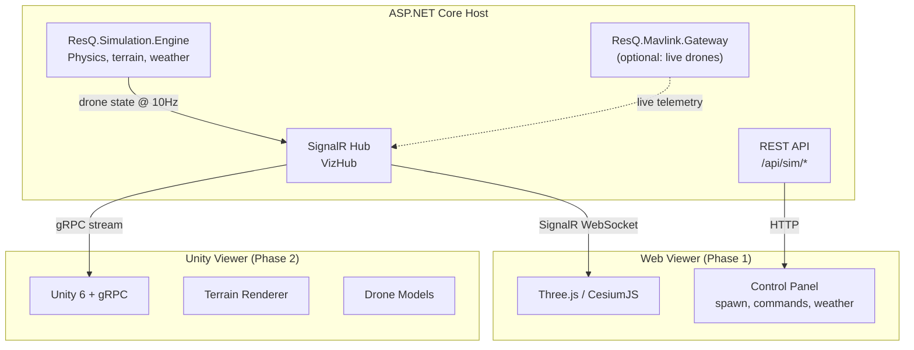

# ResQ Viz

3D visualization for ResQ drone simulations — real-time swarm monitoring, mesh topology, hazard zones, and detection events.

Two viewers sharing a common visualization protocol:

| Viewer | Stack | Audience | Status |
|--------|-------|----------|--------|
| **Web** | ASP.NET Core + SignalR + Three.js/CesiumJS | Anyone with a browser | Phase 1 |
| **Unity** | Unity 6 + gRPC client | Immersive 3D / demos | Phase 2 |

## Architecture



## Quick Start

```bash
# Web viewer (Phase 1)
cd src/ResQ.Viz.Web
dotnet run
# Open http://localhost:5000
```

## Data Source

Connects to [resq-software/dotnet-sdk](https://github.com/resq-software/dotnet-sdk) — the ResQ .NET SDK provides:
- `ResQ.Simulation.Engine` — headless physics simulation
- `ResQ.Mavlink.Gateway` — live drone telemetry via MAVLink
- `ResQ.Mavlink.Dialect` — custom detection/hazard/beacon messages

## License

Apache-2.0
