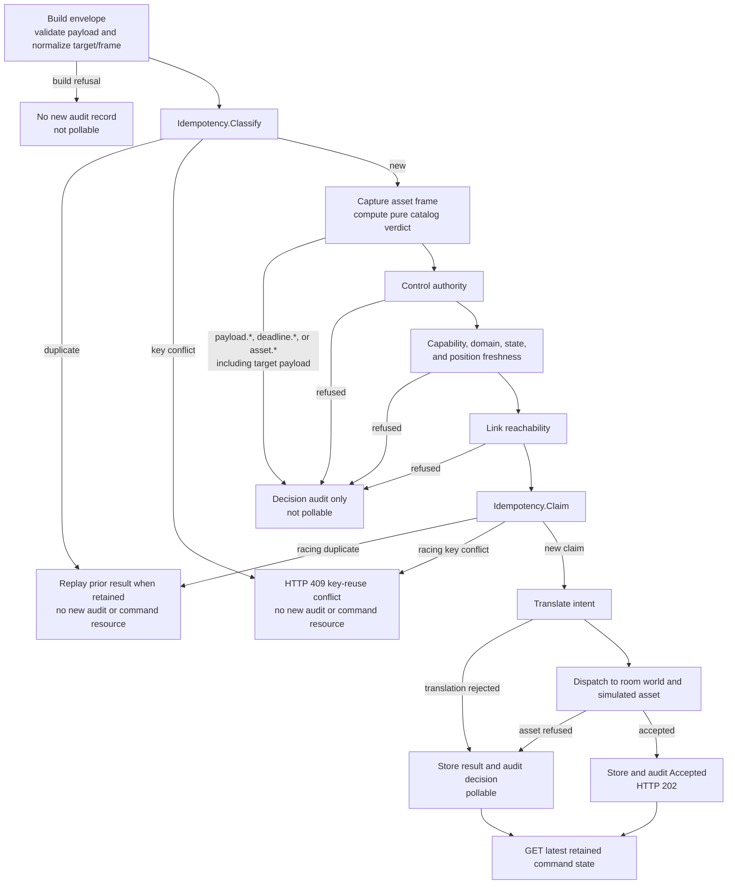
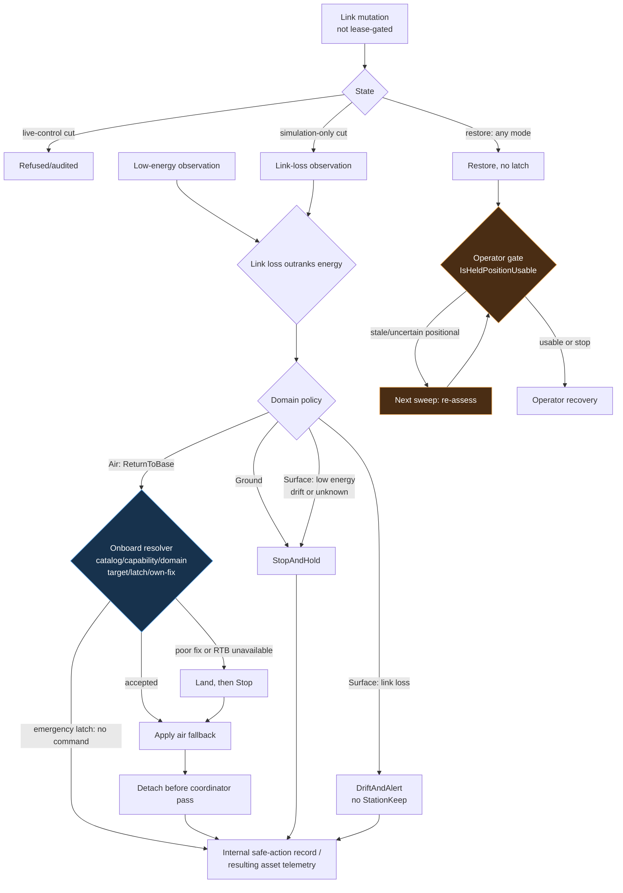
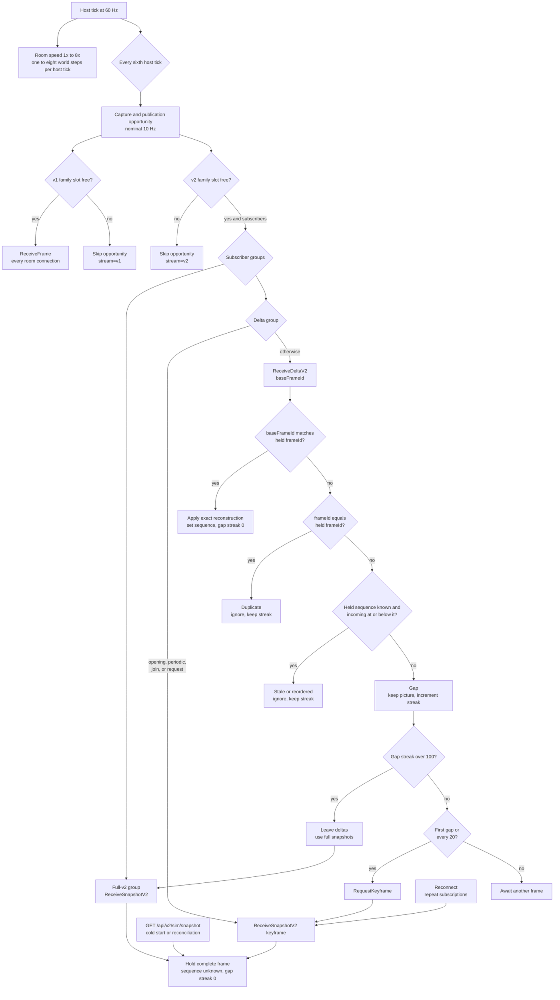
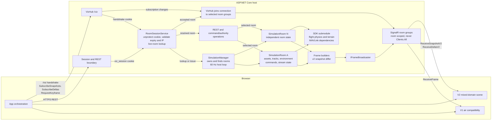

<!--
  Copyright 2026 ResQ Systems, Inc.

  Licensed under the Apache License, Version 2.0 (the "License");
  you may not use this file except in compliance with the License.
  You may obtain a copy of the License at

      http://www.apache.org/licenses/LICENSE-2.0

  Unless required by applicable law or agreed to in writing, software
  distributed under the License is distributed on an "AS IS" BASIS,
  WITHOUT WARRANTIES OR CONDITIONS OF ANY KIND, either express or implied.
  See the License for the specific language governing permissions and
  limitations under the License.
-->


<h1 align="center">ResQ Viz</h1>

<p align="center">A browser operating picture and command surface for simulated air, ground, and surface fleets.</p>

<p align="center">
  <a href="https://github.com/resq-software/viz/actions/workflows/ci.yml"></a>
  <a href="https://github.com/resq-software/viz/blob/main/LICENSE"></a>
  
  
  
</p>

**Hosted deployment:** [viz.resq.software](https://viz.resq.software/) · **Run locally:** [five-minute mixed-fleet run](#local-run)

[**Evaluate**](#evaluate) product scope and measured evidence · [**Operate**](#operate) a mixed-fleet simulation · [**Build**](#build) and test the host and browser client

> **Operating boundary:** ResQ Viz is simulation-only. Navigation, ground traversability, rollover proximity, under-keel clearance, docking guidance, and closest-point-of-approach (CPA) outputs are advisory.

<a id="contents"></a>
**Contents**

- [Evaluate ResQ Viz](#evaluate)
- [Five-minute mixed-fleet run](#five-minute-mixed-fleet-run)
- [Three-domain operating model](#three-domain-operating-model)
- [Commands, control authority, and safe actions](#commands-control-authority-safe-actions)
- [Streaming the operating picture](#streaming-operating-picture)
- [Domain physics and advisory models](#domain-physics-advisory-models)
- [Operator workspace and scenarios](#operator-workspace-scenarios)
- [System architecture](#system-architecture)
- [Contributor workflow](#contributor-workflow)
- [Security, privacy, observability, and deployment](#security-privacy-observability-deployment)
- [Reference](#reference)
- [License and project links](#license-project-links)

<a id="evaluate"></a>
## Evaluate ResQ Viz

ResQ Viz runs air vehicles, ground vehicles, and surface vessels in isolated simulation rooms. Each room owns one in-process world. Room-scoped scenario state, command history, HTTP requests, and SignalR groups keep assets and frames from crossing session boundaries.

The v2 contract describes all three implemented domains through shared asset descriptors, state, capabilities, commands, and observations. Subsurface enum values are reserved and do not describe shipped behavior. External tracks may appear in the operating picture, but they are observations rather than commandable assets.

V1 remains available for a deprecation cycle. Its frames and snapshots project air assets only, and its established command routes bypass v2 control leases. Ground and surface assets stay out of v1 shapes so existing air-only clients do not receive entities they cannot render or command.

V2 clients can subscribe to full snapshots at the 10 Hz publication cadence. Deltas are opt-in. An in-flight delta may reach a new subscriber first, but without a baseline it is unusable and the client discards it. The first frame the subscriber can act on is complete. The client can request resynchronization after a sequence gap, and the server publishes a periodic complete frame every 50 published frames. V1 and v2 have separate backpressure slots so a slow consumer on one stream does not occupy the other's slot.

V2 command requests pass through lease, capability, current-state, safe-action, and idempotency checks. The lease identifies who holds control of an asset. HTTP `202` means the gates passed and the command was handed to the simulated asset. Clients can retrieve the latest recorded state. The current production path does not advance an accepted record from subsequent simulated asset motion. Catalog, authority, link, translation, and simulated-asset refusals enter the bounded decision audit, as do accepted commands. Envelope-build failures add no decision-audit record. Duplicate and idempotency-conflict responses also return before that audit. This build has no hardware bearer, and startup rejects configuration that enables live control.

<a id="source-enforced-limits-and-gates"></a>
### Source-enforced limits and gates

These values are constraints in the source and CI configuration. They are separate from the dated measurements below.

| Constraint | Enforced value |
| :--- | ---: |
| Air assets per room | 50 |
| Total assets per room | 200 |
| Local coordinate range | ±20 km |
| Rooms per host | 100 |
| Simulation host cadence | 60 Hz |
| Operating-picture publication | Every sixth host tick, 10 Hz |
| Periodic delta-stream complete frame | Every 50 published frames |
| Built entry JavaScript CI ceiling | 819,200 bytes |
| Built entry CSS CI ceiling | 53,248 bytes |
| Live-control configuration | Rejected at startup |

<a id="reference-run-2026-09-01--4a4abd4"></a>
### Reference run: 2026-09-01 · 4a4abd4

This table records one verified run at commit `4a4abd4`; it does not replace the source-enforced constraints above. Reproduction results vary by host.

| Measurement | Verified value |
| :--- | ---: |
| xUnit tests | 1,257 passed |
| Vitest tests | 661 passed |
| 150-asset world-step p95 | 0.798 ms |
| 150-asset frame total p95, including serialization | 4.136 ms |
| Median world-step scaling, 150 versus 15 assets | 10.56× |
| Underway delta-to-snapshot payload ratio | 80.8% |
| Holding delta-to-snapshot payload ratio | 9.6% |
| Built entry JavaScript | 796,176 bytes |
| Built entry CSS | 37,569 bytes |

<a id="local-run"></a>
<a id="operate"></a>
<a id="five-minute-mixed-fleet-run"></a>
## Five-minute mixed-fleet run

Prerequisites: Git, the .NET 10 SDK, Node.js 22.12 or newer with npm, `curl`, `jq`, and a modern browser with WebGL2.

Clone the SDK submodule with the repository, then run the host in Development:

```bash
git clone --recurse-submodules https://github.com/resq-software/viz.git
cd viz
ASPNETCORE_ENVIRONMENT=Development dotnet run --project src/ResQ.Viz.Web
```

Leave this foreground terminal running while you use the browser and API.

Open [https://localhost:5001](https://localhost:5001). The browser may ask you to accept the local ASP.NET development certificate. This is expected for a development-only certificate that the browser does not yet trust. Port 5000 is also configured, but the session cookie is `Secure`, so use HTTPS for the browser and API calls.

Setting `ASPNETCORE_ENVIRONMENT` is deliberate. `dotnet run` builds Debug by default, while the project builds the Vite client through MSBuild only in Release. `Program.cs` starts and proxies the Vite development server only when the environment is Development. Leaving the environment implicit can therefore produce a host with neither a fresh Release client nor the Development proxy.

For the first mixed-fleet view, keep the default **alpine** terrain. Open the browser developer console and run:

```js
const response = await fetch('/api/sim/scenario/flood-response', {
  method: 'POST',
});
if (!response.ok) {
  throw new Error(`Scenario request failed: HTTP ${response.status}`);
}

const result = await response.json();
if (result.scenario !== 'flood-response' || result.status !== 'started') {
  throw new Error(`Unexpected scenario response: ${JSON.stringify(result)}`);
}
result
```

`flood-response` resets the browser's room and places eight assets: three multirotors, three rovers, and two surface vessels. The preset is authored against a fresh room's alpine terrain, so its ground and water match without another environment request. Changed the terrain already? Select **Alpine** in the sidebar before loading it. Do not substitute `coastal-search`, `coastal-transit`, or `port-incident` for this first run because those scenarios need the **coastal** preset or their vessels are placed on land.

Open a second terminal in the `viz` directory and keep using that same shell for this check and later examples. The commands create a separate API session, keep the encrypted, HttpOnly `viz_session` cookie in a temporary jar, and send it on each room-scoped request. The `trap` deletes the cookie jar when this second shell exits, not when the displayed block ends. `--insecure` accepts the same local certificate warning as the browser. Do not carry that option into a deployed environment.

```bash
readme_base=https://localhost:5001
readme_cookie=$(mktemp "${TMPDIR:-/tmp}/resq-viz-cookie.XXXXXX")
trap 'rm -f "$readme_cookie"' EXIT

curl --fail --silent --show-error --insecure \
  -c "$readme_cookie" \
  -X POST "$readme_base/api/sim/session" \
  | jq -e '(.roomId | type == "string") and (.roomId | length > 0) and (.expiresIn == 86400)'

curl --fail --silent --show-error --insecure \
  -b "$readme_cookie" \
  -X POST "$readme_base/api/sim/scenario/flood-response" \
  | jq -e '(.scenario == "flood-response") and (.status == "started")'

curl --fail --silent --show-error --insecure \
  -b "$readme_cookie" \
  "$readme_base/api/v2/sim/snapshot" \
  | jq -e '(.schemaVersion == "2.0") and (.assets | length == 8)'

curl --fail --silent --show-error --insecure \
  -b "$readme_cookie" \
  "$readme_base/api/v2/sim/assets" \
  | jq -e '(.descriptors | length == 8) and (.assets | length == 8)'
```

Each pipeline exits nonzero on an HTTP or contract failure. The v2 snapshot is the complete operating picture, including descriptors, asset states, tracks, detections, hazards, network state, and the environment revision. The asset inventory is narrower: it returns descriptors and current states with their capture tick and simulation time.

<a id="three-domain-operating-model"></a>
## Three-domain operating model

Every simulated asset has an `AssetDescriptor` and an `AssetState`, joined by `assetId`. The descriptor is the slow-changing, effectively immutable profile: domain, vehicle and mobility class, capabilities, dimensions, motion constraints, visual profile, and a revision. Clients cache it until the revision changes. State is current telemetry and changes at stream rate. It carries source and receive times, a per-asset sequence number, freshness, framed pose and twist, operational lifecycle state, mode, energy, health, link, mission progress, and a typed `domainState`.

Operations are capability-driven. A caller asks what an asset declares it can do instead of inferring actions from its name or renderer. The shipped profiles cover five vehicle classes across three implemented domains. `Subsurface`, `Rov`, and `Auv` remain reserved without simulation profiles or motion models.

PascalCase entries in the second column name C# `VehicleClass` enum members. Their JSON representation is a separate wire-contract concern. Lowercase entries are literal `mobilityModel` wire/config strings.

| Domain | C# `VehicleClass` member / literal `mobilityModel` string | Capability and state differences |
| :--- | :--- | :--- |
| Air | `Multirotor` / `"multirotor"` | 3D navigation, takeoff, landing, and station keeping. Air state separates heading, course, climb, wind, and three altitude references. |
| Ground | `AckermannRover` / `"ackermann"`<br>`DifferentialRover` / `"differential"`<br>`TrackedRover` / `"tracked"` | 2D navigation, reverse, parking, and stop-and-hold. Differential and tracked rovers can pivot. Ground state reports terrain, slope, traction, steering, attitude, and advisory rollover proximity. |
| Surface | `SurfaceVessel` / `"displacement-hull"` | 2D navigation, reverse, and docking. The shipped hull cannot station-keep and drifts without propulsion. Surface state reports current, waves, water depth, draft, and advisory under-keel clearance. |

`OperationalState` supplies the shared lifecycle vocabulary: `Unknown`, `Offline`, `Standby`, `Ready`, `Active`, `Holding`, `Returning`, `Recovering`, `Emergency`, and `Faulted`. `DataFreshness` is separate from link connectivity: a connected link can carry overdue telemetry, while a recent position can remain usable briefly after disconnection. Domain state then adds facts that do not belong on every asset. The JSON discriminator is `air`, `ground`, or `surface`, so clients do not treat an absent vessel draft as though a sensor failed to report it.

<a id="coordinate-boundary"></a>
### Coordinate boundary

`LocalEus` is the canonical Three.js scene frame: +X east, +Y up, and +Z south. `LocalEnu` remains a separate ground and geographic convention (+X east, +Y north, +Z up), while `LocalNed` remains the aerospace convention (+X north, +Y east, +Z down). V2 names the frame on every pose and twist rather than guessing from the asset domain.

`GlobalWgs84` is geodetic and non-Cartesian. It travels through `GeoPosition` and `GeoCommandTarget`, never as a velocity or offset vector. Every geodetic vertical value names its `VerticalReference`, such as ellipsoid, mean sea level, terrain, water surface, or chart datum, and uses positive-up metres. Local point command targets carry a framed pose plus the applicable `originId`. Two local points are comparable only when their origins agree. The checked-in `scene-alpine-default` origin is a placeholder for local development, not a surveyed deployment location. Operators must replace its identifier and coordinates together for a real site.

### V1 compatibility and v2 scope

V1 stays available for one deprecation cycle as a drone- and air-shaped compatibility surface. Existing clients continue to receive `ReceiveFrame` and use the established v1 snapshots and command routes. V2 carries mixed-domain descriptors and states, typed domain data, capability-aware commands, control authority, external tracks, complete snapshots, and opt-in deltas.

The two versions are not authority-equivalent. V1 command routes bypass v2 control authority and leases, idempotency, link-reachability checks, and held-position safe-action gates; v2 commands pass through that sequence before simulated dispatch. A migration that changes only the frame subscription does not gain v2 command semantics. Clients must adopt the v2 command and authority routes explicitly.

<a id="commands-control-authority-safe-actions"></a>
## Commands, control authority, and safe actions

V2 exposes a case-sensitive command catalog. Common commands are `stop`, `emergencyStop`, `hold`, `resumeAutonomy`, `goTo`, `returnToBase`, and `setSpeed`. Air adds `takeoff`, `land`, `setAltitude`, and `loiter`. Ground adds `driveTo`, `reverse`, and `park`, while surface adds `transitTo`, `setCourse`, `stationKeep`, `dock`, and `undock`. `followRoute` and `setSteering` are named in the source but are not registered or callable in this build. The full per-command parameter and state table belongs in the [reference](#reference).

A command envelope requires an `idempotencyKey` and a case-exact `kind`. A caller may supply `commandId`, `issuerId`, and `controlLeaseId`. The server mints the command ID when omitted and falls back to `room:{roomId}` when the issuer is blank. The remaining fields are an optional typed target, motion constraints, deadline, scalar `frame`, and a string-valued parameter bag. Point targets in a local frame and geodetic targets normalize to `LocalEus` before hashing. Classification therefore treats equivalent destinations as one logical request. Only a request classified as `New` whose later pre-claim gate rejects it leaves the key reusable. Duplicate and key-conflict outcomes remain bound to the earlier command.

### Command authority and lifecycle


```mermaid
flowchart TD
    A[Build envelope<br/>validate payload and normalize target/frame] -->|build refusal| E[No new audit record<br/>not pollable]
    A --> B[Idempotency.Classify]
    B -->|duplicate| D[Replay prior result when retained<br/>no new audit or command resource]
    B -->|key conflict| Q[HTTP 409 key-reuse conflict<br/>no new audit or command resource]
    B -->|new| C[Capture asset frame<br/>compute pure catalog verdict]
    C -->|payload.*, deadline.*, or asset.*<br/>including target payload| F[Decision audit only<br/>not pollable]
    C --> G[Control authority]
    G -->|refused| F
    G --> H[Capability, domain, state,<br/>and position freshness]
    H -->|refused| F
    H --> I[Link reachability]
    I -->|refused| F
    I --> J[Idempotency.Claim]
    J -->|racing duplicate| D
    J -->|racing key conflict| Q
    J -->|new claim| K[Translate intent]
    K -->|translation rejected| L[Store result and audit decision<br/>pollable]
    K --> M[Dispatch to room world and simulated asset]
    M -->|asset refused| L
    M -->|accepted| N[Store and audit Accepted<br/>HTTP 202]
    N --> O[GET latest retained command state]
    L --> O
```

The controller computes the entire catalog verdict after one asset-frame capture, but resolves its first refusal in a fixed order. Payload errors, including the target shape, then deadline and asset errors come before authority. Capability, domain, operational state, and position freshness come after it. Link reachability is the final pre-claim gate. The controller then claims the idempotency key, translates the typed intent, and dispatches it through the room to the simulated asset. Translation or dispatch can still reject after the claim.

Use the second shell and its `readme_base` and `readme_cookie` from the [five-minute run](#five-minute-mixed-fleet-run). Frame `2` is `LocalEus`. This request drives the flood-response supply rover toward a new scene point:

```bash
(
  set -Eeuo pipefail

  readme_command_body=$(mktemp "${TMPDIR:-/tmp}/resq-viz-readme-command.XXXXXX")
  trap 'rm -f "$readme_command_body"' EXIT

  readme_command_status=$(curl --silent --show-error --insecure \
    -b "$readme_cookie" \
    -H 'Content-Type: application/json' \
    -X POST \
    -d '{"kind":"driveTo","idempotencyKey":"readme-fr-supply-001","issuerId":"readme-operator","target":{"type":"point","point":{"frame":2,"position":{"x":-400,"y":0,"z":25}}}}' \
    -o "$readme_command_body" \
    -w '%{http_code}' \
    "$readme_base/api/v2/sim/assets/fr-supply-lead/commands")

  if [ "$readme_command_status" != 202 ]; then
    printf 'Command returned HTTP %s:\n' "$readme_command_status" >&2
    sed -n '1,200p' "$readme_command_body" >&2
    exit 1
  fi

  readme_command_id=$(jq -er '.commandId' "$readme_command_body")

  curl --fail --silent --show-error --insecure \
    -b "$readme_cookie" \
    "$readme_base/api/v2/sim/commands/$readme_command_id" \
    | jq -e --arg command_id "$readme_command_id" \
        '(.commandId == $command_id) and (.state == 1)'
)
```

HTTP `202` says the current gates passed and the command was handed to the simulated asset. It does not report completed motion. `GET /api/v2/sim/commands/{commandId}` returns the latest retained room record, but production does not advance an accepted record from subsequent simulated asset motion. The `Accepted` state above is not proof that the rover arrived. Results are bounded, so `404` can mean the command was never tracked or was evicted.

Envelope-build failures, duplicate requests, and key conflicts add neither a new decision-audit record nor a new pollable result. A matching duplicate may replay its existing result. Catalog, authority, and link refusals occur before claim, enter the decision audit, and remain unpollable. Translation and simulated-asset rejections happen after claim, so they are audited and pollable alongside accepted commands.

Control routes publish the process mode at `GET /api/v2/sim/control/mode` and the room-wide bounded audit at `GET /api/v2/sim/control/audit`. Per-asset routes report the holder, acquire a lease, or use `/renew`, `/release`, and `/preempt`. Each room owns its authority, leases are keyed by asset, and every retained audit record identifies the asset it concerns. The decision and lease windows expose dropped counts when older entries have been evicted.

An uncontrolled asset accepts a v2 command without a lease. Once a lease is live, the command issuer must match its holder. That holder may omit `controlLeaseId`. If supplied, it must name the live lease. `issuerId` and lease `holderId` are caller assertions, not authenticated people or services. The encrypted room cookie is the only identity established by the server in this build.

Requested lease durations must be 1–3,600 seconds and are capped by policy, which defaults to 120 seconds. Callers renew against the granted expiry in the response. The holder may renew or release. Expiry also frees the asset, while an emergency-role caller may preempt with a required justification. Lease audit records distinguish `Released`, `Expired`, `Preempted`, `AssetRemoved`, and `AuthorityReset` endings. V1 commands retain the bypass described under [v1 compatibility and v2 scope](#v1-compatibility-and-v2-scope).

### Safe-action decision and recovery

`GET /api/v2/sim/assets/{id}/link` reads link state. `POST` requires `available`, accepts optional `issuerId`/`reason`, and returns `isAvailable`/`changed`. Mutation is not lease-gated: any room-session holder can act despite another caller-asserted lease holder. Issuer/reason are unauthenticated audit fields. Changed cuts/restores and refused live-mode cuts enter decision audit. No-op retries do not. Live control refuses cuts but allows restoration. Stock build is simulation-only.


```mermaid
flowchart TD
    API["Link mutation<br/>not lease-gated"] --> CHANGE{State}
    CHANGE -->|live-control cut| REFUSED[Refused/audited]
    CHANGE -->|simulation-only cut| LINK[Link-loss observation]
    CHANGE -->|restore: any mode| RESTORE[Restore, no latch]
    ENERGY[Low-energy observation] --> PRIORITY{Link loss outranks energy}
    LINK --> PRIORITY
    PRIORITY --> DOMAIN{Domain policy}
    DOMAIN -->|Air: ReturnToBase| OWN
    DOMAIN -->|Ground| HOLD[StopAndHold]
    DOMAIN -->|Surface: link loss| DRIFT["DriftAndAlert<br/>no StationKeep"]
    DOMAIN -->|Surface: low energy<br/>drift or unknown| HOLD
    OWN{Onboard resolver<br/>catalog/capability/domain<br/>target/latch/own-fix}
    OWN -->|accepted| APPLY[Apply air fallback]
    OWN -->|poor fix or RTB unavailable| LAND[Land, then Stop]
    OWN -->|emergency latch: no command| RECORD
    LAND --> APPLY
    APPLY --> DETACH[Detach before coordinator pass]
    DETACH --> RECORD["Internal safe-action record /<br/>resulting asset telemetry"]
    HOLD & DRIFT --> RECORD
    RESTORE --> HELD{Operator gate<br/>IsHeldPositionUsable}
    HELD -->|stale/uncertain positional| REASSESS[Next sweep: re-assess]
    REASSESS --> HELD
    HELD -->|usable or stop| RECOVER[Operator recovery]

    classDef onboard fill:#17324d,stroke:#69b7ff,color:#fff
    classDef operator fill:#4a2d14,stroke:#ffb45c,color:#fff
    class OWN onboard
    class HELD,REASSESS operator
```

Every 60 world steps, the simulated-time governor acts at most once per trigger episode. Link loss outranks low energy. Onboard resolution checks catalog registration, capability/domain, target, emergency latch, and own fix. Air's `ReturnToBase` can degrade for a poor fix to `Land`, then `Stop`. A latch can yield no command. Ground declares `StopAndHold`. The shipped hull declares `DriftAndAlert`, lacks `StationKeep`, and grows advisory uncertainty. Low energy maps drift/unknown to `StopAndHold`. Accepted air fallback is applied before coordinator detachment. Restoration neither moves nor latches.

World dispatch rejects positional v2 commands against stale/uncertain `IsHeldPositionUsable`. `stop` is non-positional. After restoration, positional retry may await the next one-simulated-second sweep.

`link-loss-divergence` places assets. It **does not cut links**. Use `readme_base` and `readme_cookie` from the [five-minute mixed-fleet run](#five-minute-mixed-fleet-run):

```bash
(
  set -Eeuo pipefail

  readme_link_body=$(mktemp "${TMPDIR:-/tmp}/resq-viz-readme-link.XXXXXX")
  readme_link_url="$readme_base/api/v2/sim/assets/lld-ugv-1/link"
  readme_link_down=false
  readme_link_cut='{"available":false,"issuerId":"readme-operator","reason":"README link-loss drill"}'
  readme_link_restore='{"available":true,"issuerId":"readme-operator","reason":"README recovery"}'
  readme_link_key="readme-link-retry-$(date +%s)-$BASHPID"
  readme_link_command=$(jq -cn --arg key "$readme_link_key" \
    '{kind:"stop",idempotencyKey:$key,issuerId:"readme-operator"}')

  readme_expect() {
    local readme_expected=$1
    shift
    local readme_status
    readme_status=$(curl --silent --show-error --insecure \
      -b "$readme_cookie" -H 'Content-Type: application/json' \
      "$@" -o "$readme_link_body" -w '%{http_code}')
    if [ "$readme_status" != "$readme_expected" ]; then
      printf 'Expected HTTP %s, received %s:\n' "$readme_expected" "$readme_status" >&2
      sed -n '1,200p' "$readme_link_body" >&2
      return 1
    fi
  }

  readme_cleanup() {
    if [ "$readme_link_down" = true ]; then
      curl --silent --show-error --insecure -b "$readme_cookie" \
        -H 'Content-Type: application/json' -X POST -d "$readme_link_restore" \
        "$readme_link_url" >/dev/null || true
    fi
    rm -f "$readme_link_body"
  }
  trap readme_cleanup EXIT

  readme_expect 200 -X POST "$readme_base/api/sim/scenario/link-loss-divergence"
  jq -e '(.scenario == "link-loss-divergence") and (.status == "started")' "$readme_link_body"

  readme_expect 200 -X POST -d "$readme_link_cut" "$readme_link_url"
  readme_link_down=true
  jq -e '(.isAvailable == false) and (.changed == true)' "$readme_link_body"

  readme_expect 409 -X POST -d "$readme_link_command" \
    "$readme_base/api/v2/sim/assets/lld-ugv-1/commands"
  jq -e '.code == "link.unreachable"' "$readme_link_body"

  readme_expect 200 -X POST -d "$readme_link_restore" "$readme_link_url"
  jq -e '(.isAvailable == true) and (.changed == true)' "$readme_link_body"
  readme_link_down=false

  readme_expect 202 -X POST -d "$readme_link_command" \
    "$readme_base/api/v2/sim/assets/lld-ugv-1/commands"
  jq -e '(.commandId | type == "string") and (.commandId | length > 0)' "$readme_link_body"
)
```

Identical JSON/key succeeds because link refusal precedes claim. Immediate restoration proves gating/idempotency, not fallback execution. To observe ground fallback, keep the link down through the next simulated-second sweep and inspect v2 snapshot. Outputs remain simulation/advisory.

<a id="streaming-operating-picture"></a>
## Streaming the operating picture

The SignalR hub is `/viz`. It sends `ReceiveFrame`, `ReceiveSnapshotV2`, and `ReceiveDeltaV2`. Clients call `SubscribeSnapshots`, `SubscribeDeltas`, and `RequestKeyframe`. Both subscription methods return the server's schema version except the refused fresh delta rejoin below. Every accepted connection remains in its room's v1 group and receives `ReceiveFrame`. `SubscribeSnapshots(true)` adds the connection to the full-v2 group. `SubscribeDeltas(true)` moves it from full-v2 to the delta group without removing v1 membership. Intent belongs to the connection, so reconnecting clients repeat both calls and turning deltas off restores full-v2 when that was the recorded intent.

**Capture and backpressure.** During normal unpaused operation, 1x, 2x, 4x, and 8x advance exactly one, two, four, and eight world steps per 60 Hz host tick. A queued manual step takes precedence and advances one even at 8x. Every sixth host tick is a capture and publication opportunity, nominally 10 Hz even while paused. Speed does not multiply network cadence. Separate in-flight slots cover v1 and the v2 family. A busy family skips the opportunity while the other can send. `resq.viz.frames_dropped_backpressure` records it with `stream=v1` or `stream=v2`.

**Delta chain.** Each room owns one baseline and stream sequence. The exact entity diff includes removed IDs and complete per-frame observations. A carried asset sends source time, receive time, sequence, freshness, link last-heard time, and exact power when changed. The chain advances when handed to transport, before the awaited send completes. A failed v2 send requests a repairing keyframe because clients may not hold that baseline.

A `ReceiveSnapshotV2` keyframe starts a chain with no baseline. Resync requests, environment revision changes, tick regression or world replacement, pending joins, and every 50 published v2 frames also trigger one. Five seconds is nominal only under uninterrupted 10 Hz publication. Backpressure extends wall time. A delta already in transport can reach a joiner first and is unusable without its base. The first actionable frame is complete.

### Frame production, delivery, and repair


```mermaid
flowchart TD
    HOST[Host tick at 60 Hz] --> SPEED[Room speed 1x to 8x<br/>one to eight world steps per host tick]
    HOST --> SIXTH{Every sixth host tick}
    SIXTH --> CAPTURE[Capture and publication opportunity<br/>nominal 10 Hz]
    CAPTURE --> V1SLOT{v1 family slot free?}
    CAPTURE --> V2SLOT{v2 family slot free?}
    V1SLOT -->|yes| V1[ReceiveFrame<br/>every room connection]
    V1SLOT -->|no| DROP1[Skip opportunity<br/>stream=v1]
    V2SLOT -->|no| DROP2[Skip opportunity<br/>stream=v2]
    V2SLOT -->|yes and subscribers| V2{Subscriber groups}
    V2 --> FULL[Full-v2 group<br/>ReceiveSnapshotV2]
    V2 --> DELTA{Delta group}
    DELTA -->|opening, periodic,<br/>join, or request| KEYFRAME[ReceiveSnapshotV2 keyframe]
    DELTA -->|otherwise| PATCH[ReceiveDeltaV2<br/>baseFrameId]
    FULL --> COMPLETE[Hold complete frame<br/>sequence unknown, gap streak 0]
    KEYFRAME --> COMPLETE
    PATCH --> MATCH{baseFrameId matches<br/>held frameId?}
    MATCH -->|yes| APPLY[Apply exact reconstruction<br/>set sequence, gap streak 0]
    MATCH -->|no| DUP{frameId equals<br/>held frameId?}
    DUP -->|yes| IGNORE1[Duplicate<br/>ignore, keep streak]
    DUP -->|no| OLD{Held sequence known and<br/>incoming at or below it?}
    OLD -->|yes| IGNORE2[Stale or reordered<br/>ignore, keep streak]
    OLD -->|no| GAP[Gap<br/>keep picture, increment streak]
    GAP --> LIMIT{Gap streak over 100?}
    LIMIT -->|yes| FALLBACK[Leave deltas<br/>use full snapshots]
    FALLBACK --> FULL
    LIMIT -->|no| PACE{First gap or<br/>every 20?}
    PACE -->|yes| REPAIR[RequestKeyframe]
    PACE -->|no| WAIT[Await another frame]
    REPAIR --> KEYFRAME
    RECONNECT[Reconnect<br/>repeat subscriptions] --> KEYFRAME
    REST[GET /api/v2/sim/snapshot<br/>cold start or reconciliation] --> COMPLETE
```

**Client reconstruction.** A full snapshot or keyframe resets the gap streak and leaves the held stream sequence unknown. A matching `baseFrameId` applies atomically without validating `baseSequence`. The exact reconstruction removes named entities, applies carried stamps and observations, establishes the sequence, and resets the streak. A delta whose `frameId` is held is a duplicate. Only after a delta establishes the held sequence can a mismatched delta at or below it be stale or reordered. Duplicate and stale outcomes are ignored without incrementing or resetting the streak. Every other mismatch, missing baseline, or merge failure is a gap and increments it.

On a gap, the browser keeps rendering its last good picture and calls `RequestKeyframe` for the first and every 20 consecutive gap outcomes. Periodic keyframes and reconnect subscriptions provide other repair paths. When the streak exceeds 100, the client returns to full snapshots. `GET /api/v2/sim/snapshot` supports cold start or reconciliation.

**Resync budget.** The opening delta subscription gets one free keyframe. Later re-subscriptions, rejoins, and `RequestKeyframe` share five requests per 10 seconds. An exhausted in-place `SubscribeDeltas(true)` returns the schema version without forcing and keeps delta membership. An exhausted fresh rejoin throws `HubException` and preserves the prior state, while `RequestKeyframe` returns `false` when exhausted or inapplicable.

**Observability budgets.** Energy display quanta choose a whole changed record or the carried channel, which preserves exact power. They never decide whether to send a frame or round reconstructed state. The underway and holding ratios in the [dated reference run](#reference-run-2026-09-01--4a4abd4) measure those payload shapes.

<a id="domain-physics-advisory-models"></a>
## Domain physics and advisory models

The shared contract does not flatten motion into one generic vehicle. Air uses SDK flight physics. Ground models wheel or track geometry against terrain, while surface models a displacement hull in wind, current, and water depth. External tracks sit beside assets as observations.

> **Model boundary:** See [Evaluate ResQ Viz](#evaluate), the [source-enforced limits](#source-enforced-limits-and-gates), and the [coordinate boundary](#coordinate-boundary).

<a id="domain-model-comparison"></a>
### Motion, state, commands, and safe actions

| Domain / shipped class | Shipped motion model / input | Published domain state | Typical commands | Safe-action default | Advisory output |
| :--- | :--- | :--- | :--- | :--- | :--- |
| Air / `Multirotor` | SDK multirotor / flight commands | Airborne, heading/course, climb, three altitudes, wind, airspeed | Take off, fly, loiter, land | Return to launch, then land/stop fallback | Position freshness and bounded uncertainty growth |
| Ground / `AckermannRover`<br>`DifferentialRover`<br>`TrackedRover` | Bicycle or skid-steer / speed and turn guidance | Speed, steering, attitude, terrain, traction, immobilisation | Drive, reverse, park, stop | Stop and hold | Straight-line traversability and rollover proximity |
| Surface / `SurfaceVessel` | Displacement hull / thrust and rudder response | Heading/course, surge/sway, current, depth, draft, clearance, waves | Transit, set course/speed, dock, undock, stop | Drift and alert | Water-route clearance and docking guidance |
| External track / none | Fused reported pose/velocity | Classification, sources, identity, accuracy, confidence, age | None | None, observations are not commandable | CPA, bearing, closing state, encounter geometry |

<a id="air-physics"></a>
### Air: SDK flight-state projection

The air adapter leaves multirotor integration in the pinned simulation SDK. It projects framed pose/twist, ground velocity, airspeed, battery energy, and height above terrain, launch, and mean sea level. The command adapter translates v2 intent into SDK flight commands. Launch position is home. Link loss declares return to base; without a usable position fix, the resolver falls back to land and then stop.

<a id="ground-physics"></a>
### Ground: profile-specific contact and mobility

Three rover profiles ship. Ackermann uses a rate-limited bicycle model, reaches 8 m/s, and needs a 3.2 m turning radius. Differential and tracked rovers drive each side independently, reach 5 and 3.5 m/s, and can pivot in place. The tracked profile trades speed for the largest grade and step envelope: 35 degrees and 0.30 m, versus 30 degrees/0.15 m for differential and 25 degrees/0.12 m for Ackermann.

A spawn discards the requested vertical coordinate and settles the chassis on terrain under its footprint. There is no suspension model. Footprint-scaled normal sampling and low-pass filtering stabilise published roll and pitch. Surface material and precipitation set available traction. Grade, cross-slope, surface conditions, and zones can derate speed. An excessive step blocks the straight-line preview or, if reached in motion, triggers collision rollback. Water, excessive grade, or insufficient grip can immobilise autonomy while leaving slow reverse recovery available.

Pivot-capable rovers turn toward a target before driving. Ackermann guidance uses look-ahead, steering lock, cornering limits, and braking to arc toward it. The target check samples only the straight segment, up to 512 points, and reports clear, costly, unknown, or blocked ground. It neither searches for another route nor provides general obstacle avoidance.

Rollover proximity compares cross-slope with a profile-specific inferred stability angle and publishes a 0–1 fraction. The lower operational limit triggers advice and a speed reduction; the inferred tipping band may refuse the straight-line preview. Mobility and rollover remain quasi-static decision support, not certified limits. Ground link loss stops and holds.

<a id="surface-physics"></a>
### Surface: hull response, water clearance, and docking

The shipped 6.5 m workboat is a single-screw displacement hull with first-order thrust and rudder response, a 6 m/s ahead limit, 2 m/s astern limit, and 12 m minimum turn radius. Its 0.6 m/s minimum is a steerage advisory, not a floor: rudder authority falls with speed. Ground track combines surge and sway with coupled current. Wind adds leeway, turns add sideslip, and zero thrust leaves drift.

Water checks combine the water mask, bathymetry, the 0.55 m draft, and prohibited zones. Under-keel clearance is depth minus draft. This hull's margin is 0.305 m: safe at or above twice the margin, marginal down to it, critical below it, and aground at zero or less. Critical clearance reduces speed smoothly. Aground recovery retains 15% of the speed ceiling. All bands and route checks are advisory and use simulated bathymetry.

Docking uses a staged pose approach. Approach, corridor, and final phases tighten speed from 50% to 25% to 12% of hull maximum before mooring. Timeout, corridor departure, obstructed water, lost position, overshoot, or operator cancellation abort the attempt, stop thrust, and leave the vessel commandable. Docking guidance is advisory.

Wave heave, roll, and pitch are deterministic visual motion only. They never feed navigation, clearance, or hull dynamics. Generic station-keeping code exists, but the shipped hull does not declare `StationKeep`, refuses that command, and uses drift-and-alert on link loss.

<a id="external-tracks-cpa"></a>
### External tracks and closest approach

An external track is structurally separate from an asset: it has its own identifier space, no capabilities, and no command endpoint. Reports carry cooperative or non-cooperative sources, classification, identity, motion, accuracy, and confidence. For an existing identifier, reports at or after the held observation time fuse. The accepted report's motion and accuracy win; absent classification, label, or transponder data do not erase prior reports. Sources are recency-ordered.

Each room uses simulated time, making replay, aging, and eviction deterministic. Defaults: fresh for 5 seconds, stale through 20 with confidence decay, lost afterward, retired after 60. Capacity: 256 tracks, 8 sources each. Existing-track updates bypass capacity. For a new identifier at capacity, the store removes expired tracks first. If still full, it replaces the stalest only when newer. Otherwise, the store refuses and counts it. Older reports for a held identifier are separately refused as out of order.

CPA extrapolates two reported motions as straight lines. It reports current slant and horizontal range. For the closest approach, it publishes slant and horizontal distance, vertical separation, and time to that point. Relative bearing, closing state, and encounter geometry complete the advisory. The result also carries the older input age, lower confidence, and worse freshness of the two observations. CPA issues no manoeuvre, applies no navigation rules, and confers no collision-avoidance authority.

<a id="operator-workspace-scenarios"></a>
## Operator workspace and scenarios

Asset selection and lifecycle are domain-neutral across scene, outliner, inspector, mini-map, and panel. Air loads first; ground and surface render on demand behind a fallback, while persistent fleet filters and capability-gated panel commands support mixed fleets.

The operating picture combines domain overlays, read-only tracks with CPA, event log, mini-map, orbit/free-flight/follow/chase/cockpit/FPV cameras, an editor dock with outliner/inspector/gizmo, DVR replay, and scene JSON.

Selection/filter/overlay/camera/replay/export stays browser-only. Scenarios, air nudges, backhaul, live transport, imports, and gizmo release mutate the room.

<a id="scenario-catalog"></a>
### Scenario catalog and environments

`RunScenario` destructively resets the room, then spawns assets; ground/surface members settle against terrain during the request. Before an unbound load, **SELECT coastal** for `coastal-search`, `coastal-transit`, or `port-incident`. **RESTORE alpine** for `mixed-ground`, `ground-convoy`, `flood-response`, `link-loss-divergence`, or `mixed-load-150`. Fresh rooms start alpine. Unbound loads keep current presentation. `link-loss-divergence` does not cut links.

Six definitions exist: `wildfire-interface`, `hurricane-melissa`, `flood-riverine`, `urban-collapse`, `alpine-sar`, and `canyon-sar`. A matching `resq:scenario-start` applies atmosphere/camera. Manual override suppresses only terrain/water. Cards emit after successful requests but expose only unbound `single`, `swarm-5`, `swarm-20`, and `sar`. Keyboard adds unbound `multi-agency-sar`. Import allow-list uses those cards, rejecting all six bindings and `multi-agency-sar`. Accepted imports emit without awaiting success. No shipped control/import reaches bound presentation, and exported `multi-agency-sar` does not round-trip. Direct REST resets/spawns without applying bound presentation.

<details>
<summary>Complete scenario catalog (19 presets)</summary>

| Scenario | Air | Ground | Surface | Purpose / presentation |
| :--- | ---: | ---: | ---: | :--- |
| `single` | 1 | 0 | 0 | Smoke test (current). |
| `swarm-5` | 5 | 0 | 0 | Formation (current). |
| `swarm-20` | 20 | 0 | 0 | Dense swarm (current). |
| `sar` | 3 | 0 | 0 | Lead/scout/relay (current). |
| `multi-agency-sar` | 12 | 0 | 0 | Three-vendor (current). |
| `wildfire-interface` | 5 | 0 | 0 | Fire-recon (ridgeline/smoke/survey). |
| `hurricane-melissa` | 6 | 0 | 0 | Storm-ISR (coastal-surge/overcast/survey). |
| `flood-riverine` | 5 | 0 | 0 | River-survey (alpine-flood/clear/survey). |
| `urban-collapse` | 6 | 0 | 0 | Structure-search (canyon/dust/survey). |
| `alpine-sar` | 4 | 0 | 0 | Avalanche-response (alpine/clear/survey). |
| `canyon-sar` | 4 | 0 | 0 | Gorge-search (canyon/high-sun/survey). |
| `mixed-ground` | 3 | 3 | 0 | Air/three-rover hillside (alpine). |
| `ground-convoy` | 1 | 3 | 0 | Air/rover convoy (alpine). |
| `coastal-search` | 3 | 2 | 3 | Air/shore/vessel search (coastal). |
| `coastal-transit` | 1 | 0 | 3 | Air/vessel column (coastal). |
| `flood-response` | 3 | 3 | 2 | Mappers/supply/ferries (alpine). |
| `port-incident` | 2 | 3 | 3 | Overwatch/cordon/samplers (coastal). |
| `link-loss-divergence` | 1 | 1 | 1 | Fallback comparison (alpine/no cut). |
| `mixed-load-150` | 50 | 50 | 50 | Three 50-asset grids (alpine). |

</details>

<a id="live-controls"></a>
### Canvas gestures and keyboard shortcuts

Checked-in HTML help is stale. This table follows instantiated handlers. `Out` excludes INPUT/SELECT. `Browser` is browser-only. `Request` mutates the room. `Both` combines browser state with a request.

<details>
<summary>Canvas gestures and keyboard shortcuts</summary>

| Method or key | Context or modifier | Action | Scope |
| :--- | :--- | :--- | :--- |
| LMB / MMB / wheel | Canvas | Orbit / pan / zoom. | Browser |
| RMB + W/S/A/D/Q/E/Space | Shift: 4× | Look and fly six axes. | Browser |
| Canvas click | No target pending | Select asset. Empty clears non-air. | Browser |
| Canvas click | Selected air, terrain/pass-through hit | Send v1 air `goto` at held altitude. | Request |
| Canvas click | Capability target pending | Supply terrain target. Miss cancels. | Both |
| Mini-map click | Within 80 m | Select nearest entity. | Browser |
| R | Out | Reset room. | Request |
| Tab | Out | Toggle sidebar. | Browser |
| 1–5 | Unshifted, out | `single` / `swarm-5` / `swarm-20` / `sar` / `multi-agency-sar`: reset/load, keep presentation. | Request |
| Ctrl+Shift+R | Out | Investor camera. | Both (reset) |
| Shift+1–8 | Out, no Ctrl/Meta | Overview/tactical/cockpit-follow/ground/investor/air-chase/ground-chase/surface-chase. | Browser |
| K | Out, no Ctrl/Meta | Toggle backhaul. | Request |
| V / H / G | Out | Velocity/halos/formation. | Browser |
| C | Out, selected group | Free → Chase → FPV. No group returns Free. | Browser |
| I | Plain, outside INPUT/SELECT/TEXTAREA/editable | Cockpit and sensor stats. | Browser |
| M | Out, selected v1 drone | Toggle gizmo. Release sends `goto`. | Both |
| F | Out, selected asset | Toggle follow. | Browser |
| Home | Out, fleet | Fit visible fleet. | Browser |
| [ / ] | Out, fleet | Previous/next visible asset. | Browser |
| W/S/A/D/Q/E | Out, selected air, RMB up | Move/yaw/climb. Shift enlarges step. | Request |
| ? / Escape | Out. Panel Escape works focused. | Hints/cancel/dismiss. | Browser |
| Backslash (`\`) | Out, no Ctrl/Meta/Alt | Toggle editor dock. | Browser |
| Space | Out, no Ctrl/Meta/Alt | Live/replay pause. | Request live / browser replay |
| Period (`.`) | Out, no Ctrl/Meta/Alt | Live/replay step. | Request live / browser replay |
| P / O | Out, no Ctrl/Meta/Alt | Toggle PIP / cycle mode. | Browser |

</details>

Three collisions: plain `I` toggles cockpit/stats; `Space` drives DVR and climbs under RMB. `Ctrl+Shift+R` resets and toggles investor because reset accepts modifiers. Period is DVR-only. Editor transport is not instantiated.

<a id="system-architecture"></a>
## System architecture

[`Program.cs`](src/ResQ.Viz.Web/Program.cs) registers the host pipeline and services. `SimulationManager` owns at most 100 isolated rooms and advances them from one 60 Hz host loop. Each `SimulationRoom` owns its `AssetWorld` assets, terrain, weather, water, tracks, swarm coordinator, command records, and stream state. `ControlAuthorityRegistry` weakly associates one authority with each room. `RoomSessionService` unprotects `viz_session`, validates expiry and the caller's IP bucket, then asks the manager for the live room. A zero-connection room becomes eligible after more than 60 seconds idle. The reaper checks every 10 seconds.

REST controllers and command services use only the resolved room. The hub validates through the same service before joining an accepted connection to room groups. Every sixth host tick is a publication opportunity. If both stream slots are busy, the room skips capture and building, while a busy v2 slot alone skips snapshot and differ work. Claimed paths use `VizFrameBuilder` for v1 and subscriber-gated `VizSnapshotV2Builder` for v2. `IFrameBroadcaster` isolates SignalR transport from simulation code. The SDK submodule supplies flight physics, terrain interfaces, and MAVLink dependencies. Its Mesh project is referenced but unwired.

### System context and room isolation


```mermaid
flowchart LR
    subgraph Browser[Browser]
        B[App orchestration]
        V1[V1 air compatibility]
        V2[V2 mixed-domain scene]
        B --> V1
        B --> V2
    end

    subgraph Host[ASP.NET Core host]
        API[Session and REST boundary] -->|viz_session cookie| RSS[RoomSessionService<br/>unprotect cookie, validate expiry and IP<br/>live-room lookup]
        HUB[VizHub /viz] -->|handshake cookie| RSS
        RSS -->|lookup or issue| M[SimulationManager<br/>owns and finds rooms<br/>60 Hz host loop]
        RSS -->|resolved room| OPS[REST and command/authority<br/>operations]
        RSS -->|accepted room| JOIN[VizHub joins connection<br/>to selected room groups]
        HUB -->|subscription changes| JOIN
        M --> RA[SimulationRoom A<br/>assets, tracks, environment<br/>commands, stream state]
        M --> RN[SimulationRoom N<br/>independent room state]
        OPS -->|selected room| RA
        OPS -->|selected room| RN
        RA --> F[Frame builders<br/>v2 snapshot differ]
        RN --> F
        F --> T[IFrameBroadcaster]
        JOIN --> G[SignalR room groups<br/>room scoped, never Clients.All]
        T --> G
        RA --> SDK[SDK submodule<br/>flight physics and terrain<br/>MAVLink dependencies]
        RN --> SDK
    end

    B -->|HTTPS REST| API
    B -->|/viz handshake<br/>SubscribeSnapshots, SubscribeDeltas<br/>RequestKeyframe| HUB
    G -->|ReceiveFrame| V1
    G -->|ReceiveSnapshotV2<br/>ReceiveDeltaV2| V2
```

In the browser, [`app.ts`](src/ResQ.Viz.Web/client/app.ts) starts analytics bootstrap before the scene and SignalR, then coordinates session, transport, scene updates, controls, and deferred modules. Provider configuration stays inside `analytics.ts`. `AssetManager` owns domain-neutral spawn, update, interpolation, selection, picking, and disposal. Air registers eagerly. Ground and surface renderer chunks load on first use. `AssetRegistry` resolves by visual profile, vehicle class, then domain, showing a selectable fallback while a renderer loads or none exists. One `sceneFrame` projection feeds renderers, overlays, panels, and cameras. Descriptor and state records drive read-only detail cards. Command controls separately fetch the capability report and offer no commands without it. Editor, chase camera, fleet UI, and track overlay modules load behind deferred seams.

- **Terrain path.** Matching TypeScript and C# functions generate five 4 km presets. A URL image heightmap is decoded, installed, and rendered in the browser first. After session bootstrap, the client attempts a room-scoped upload, and only a successful POST makes it the server's authoritative DEM. Failure can leave browser terrain and server physics mismatched. Optional hydraulic erosion bakes a deterministic preset grid server-side, installs it in the room, and returns the same heights for the browser mesh. Erosion applies to presets, not a general editor.

- **Geometry cache.** Terrain keeps its Y-height `Float32Array` in an L1 memory map and writes a deflate-raw, base64 copy to per-tab `sessionStorage` as L2. At 500 segments, 501 × 501 float heights consume exactly 1,004,004 raw bytes, about 0.96 MiB, before compression and base64. XYZ positions are not cached.

- **WebGPU sensors.** A deferred boot path CPU-voxelizes `terrainHeight` into a sparse brick map. Its default 128³ grid at 8 m per voxel spans 1,024 m per axis. It is centered on X/Z and begins at ground level on Y, while the rendered terrain spans 4,000 m. `raysOutsideWorld` counts origins beyond that sensor volume. Rays that never enter its AABB can appear as misses. Boot URL parameters `worldGrid`, `voxelScale`, and `worldOriginX/Y/Z` can change the bounds. Compute ray marching powers mesh-link line-of-sight and per-drone 16 × 256 LiDAR scans, and terrain changes rebuild the map. Without WebGPU, or after initialization failure, links retain their unoccluded presentation, LiDAR points stay absent, and the Three.js renderer continues.

- **Post-processing.** Three.js 0.185.1 renders through `WebGLRenderer`. A deferred chunk adds selective emissive bloom, `GTAOPass`, `OutputPass`, and a display-space color grade. While that chunk loads, or if fetch or construction fails, the scene renders directly with ACES filmic tone mapping and the renderer's sRGB output. The current path does not use `SSAOPass`.

<a id="build"></a>
<a id="contributor-workflow"></a>
## Contributor workflow

Install Git with submodule support, the .NET 10 SDK, Node.js 22.12 or newer with npm, and a browser with WebGL2. WebGPU is optional and adds compute-backed sensors. See the version badges above [Contents](#contents) and the [client lockfile](src/ResQ.Viz.Web/package-lock.json).

For an existing checkout, initialize the SDK submodule and make a clean client install from the web project:

```bash
git submodule update --init --recursive
cd src/ResQ.Viz.Web
npm ci --legacy-peer-deps
cd ../..
```

Run the repository gates from the root, in order:

```bash
dotnet restore ResQ.Viz.sln
dotnet build ResQ.Viz.sln -c Debug --no-restore
dotnet build ResQ.Viz.sln -c Release --no-restore
dotnet test tests/ResQ.Viz.Web.Tests/ResQ.Viz.Web.Tests.csproj -c Release --no-build --no-restore
dotnet format ResQ.Viz.sln --no-restore --verify-no-changes
```

Release invokes the npm and Vite client build through MSBuild. Debug skips it. At runtime, the Development environment starts and proxies the Vite development server. From the repository root, run:

```bash
cd src/ResQ.Viz.Web
npm ci --legacy-peer-deps
npm run typecheck
npm test
npm run build
cd ../..
```

The permanent performance and size gates below are distinct from the dated [reference run](#reference-run-2026-09-01--4a4abd4). The first four live in `MixedFleetLoadTests`, and CI enforces the bundle ceilings.

| Gate | Required bound |
| :--- | ---: |
| 150-asset world-step p95 | ≤ 16.667 ms |
| 150-asset frame total p95 | ≤ 100 ms |
| Median step ratio, 150 versus 15 assets | ≤ 25× |
| Delta/snapshot payload | < 90% underway, < 25% holding |
| Built entry JavaScript / CSS | ≤ 819200 / ≤ 53248 bytes |

Run the determinism and load suites separately when changing simulation order, timing, snapshots, or deltas. Their `--no-build --no-restore` options require the successful Release build above. Detailed logging prints the measurements:

```bash
dotnet test tests/ResQ.Viz.Web.Tests/ResQ.Viz.Web.Tests.csproj -c Release --no-build --no-restore --filter "FullyQualifiedName~ReplayDeterminismTests" --logger "console;verbosity=detailed"
dotnet test tests/ResQ.Viz.Web.Tests/ResQ.Viz.Web.Tests.csproj -c Release --no-build --no-restore --filter "FullyQualifiedName~MixedFleetLoadTests" --logger "console;verbosity=detailed"
node -e 'const fs=require("node:fs"),d="src/ResQ.Viz.Web/wwwroot/assets/";for(const f of fs.readdirSync(d).filter(f=>/^index-.*\.(js|css)$/.test(f)))console.log(f,fs.statSync(d+f).size,"bytes")'
```

Work on a topic branch, using a dedicated worktree when other changes are active. Keep commits scoped and preserve unrelated local changes.

C# changes need the Apache-2.0 header and XML documentation on public APIs. Backend tests use xUnit with FluentAssertions. Vitest runs the central client suite in `src/ResQ.Viz.Web/client/__tests__/`, and documentation stays derived from source and tests.

Install the canonical hook documented in [AGENTS.md](AGENTS.md) and the [organization guide](https://github.com/resq-software/dev/blob/main/AGENTS.md#git-hooks). It runs alongside this repository's Release-build and formatting checks. For a POSIX shell:

```bash
curl -fsSL https://raw.githubusercontent.com/resq-software/dev/main/scripts/install-hooks.sh | sh
```

For PowerShell:

```powershell
irm https://raw.githubusercontent.com/resq-software/dev/main/scripts/install-hooks.ps1 | iex
```

`.github/workflows/ci.yml` runs the .NET gates plus client typecheck, build, Vitest, and bundle enforcement. `.github/workflows/security.yml` runs the separate security workflow.

<details>
<summary><strong>Repository map</strong></summary>

Vite generates `src/ResQ.Viz.Web/wwwroot/`. Edit files under `src/ResQ.Viz.Web/client/` instead.

| Path | Contents |
| :--- | :--- |
| `ResQ.Viz.sln` | Host and test solution |
| `src/ResQ.Viz.Web/Program.cs` | Host composition and middleware |
| `src/ResQ.Viz.Web/Controllers/` | Session and simulation HTTP APIs |
| `src/ResQ.Viz.Web/Hubs/` | SignalR snapshot and delta hub |
| `src/ResQ.Viz.Web/Services/` | Rooms, streaming, scenarios, commands, terrain, and weather |
| `src/ResQ.Viz.Web/Services/Assets/`<br>`src/ResQ.Viz.Web/Services/Assets/Ground/`<br>`src/ResQ.Viz.Web/Services/Assets/Surface/` | Air, ground, and surface assets, dynamics, navigation, and safety |
| `src/ResQ.Viz.Web/Services/Tracks/` | External-track fusion and CPA |
| `src/ResQ.Viz.Web/Models/` | API, command, asset, track, and frame contracts |
| `src/ResQ.Viz.Web/client/` | Browser entry, scene, controls, terrain, and UI |
| `src/ResQ.Viz.Web/client/assets/`<br>`src/ResQ.Viz.Web/client/assets/renderers/`<br>`src/ResQ.Viz.Web/client/assets/overlays/` | Asset lifecycle and domain presentation |
| `src/ResQ.Viz.Web/client/editor/`<br>`src/ResQ.Viz.Web/client/sensors/`<br>`src/ResQ.Viz.Web/client/webgpu/`<br>`src/ResQ.Viz.Web/client/styles/` | Workspace tools, sensor UI, GPU compute, and CSS sources |
| `tests/ResQ.Viz.Web.Tests/`<br>`src/ResQ.Viz.Web/client/__tests__/` | Backend and client tests |
| `lib/dotnet-sdk/` | Simulation and MAVLink SDK submodule |
| `src/ResQ.Viz.Web/ResQ.Viz.Web.csproj`<br>`src/ResQ.Viz.Web/package.json`<br>`src/ResQ.Viz.Web/package-lock.json`<br>`src/ResQ.Viz.Web/vite.config.ts` | Host and client build configuration |
| `.github/workflows/ci.yml`<br>`.github/workflows/security.yml`<br>`.git-hooks/local-pre-push` | CI, security scanning, and local gates |
| `docs/` · `AGENTS.md` · `SECURITY.md` · `LICENSE` | Plans, contributor rules, reporting policy, and license |

</details>

<a id="security-privacy-observability-deployment"></a>
## Security, privacy, observability, and deployment

### Simulation boundary and request controls

ResQ Viz has no hardware bearer: commands stay inside isolated in-process simulation rooms, and startup rejects `ControlAuthority:AllowLiveControl=true`.

`viz_session` is a protected 24-hour room binding, not user authentication. Bootstrap refreshes a valid cookie's expiry. The cookie is `HttpOnly`, `Secure`, `SameSite=Strict`, essential, scoped to `/`, and bound to the caller's IPv4 `/24` or IPv6 `/64` prefix. HTTPS is required. `destructive` and `general` are process-wide fixed windows of 10 and 60 requests per minute, shared across matching requests rather than partitioned by IP or caller. Replicas enforce independent quotas. Security and API cache headers run before Vite/static middleware. Later middleware redirects HTTP requests reaching the downstream API/controller pipeline and adds HSTS to their production HTTPS responses. Static or Vite responses can short-circuit first and need edge HTTPS enforcement for uniform coverage.

### Browser and exported data

`localStorage` retains visual settings, hint visibility or dismissal, cockpit visibility, editor-dock collapse, and fleet-filter choices. Per-tab `sessionStorage` holds compressed terrain geometry under `resq-geo-v1-*`. Terrain and scenario choices reach the server in requests, while operators persist or share them through `resq-scene.json` export/import rather than browser storage.

### Process state and optional exports

Rooms and their command, idempotency, and audit state are room-scoped process memory. One process is the default supported topology. Command results cap at 512. Idempotency entries become eligible for age eviction ten minutes after update, but the 1,024-entry capacity can evict older entries sooner. Command decisions retain 256 entries. Default lease audit capacity is 256 and configurable. Resets clear command results, idempotency entries, and active leases while retaining bounded audit trails. The ten-second reaper removes zero-connection rooms idle for more than 60 seconds. Reaping or a rolling restart discards active rooms and state, which instances neither share nor retain as a durable security audit.

Unconfigured PostHog or GA4 providers are omitted, and rejected initialization is logged. When enabled, providers may persist identifiers or cookies and send pageview, autocapture, event, and identity data to their endpoints. PostHog defaults to `localStorage+cookie` and uses a `.resq.software` cross-subdomain cookie on ResQ hosts. Cloudflare Web Analytics is separate: a deployment may inject its script and beacon, and the CSP permits those endpoints. OpenTelemetry covers ASP.NET Core, HTTP clients, runtime data, scenario activities, and Viz broadcast, resync, backpressure, and timing meters. OTLP export requires `OTEL_EXPORTER_OTLP_ENDPOINT` and an operator-provided collector.

### Deployment facts

Replicas require session affinity: cookie validation requires the room in the receiving process. A shared ASP.NET Core data-protection key ring permits cross-instance cookie decryption only; it does not replicate rooms or state. `ForwardedHeaders:Enabled` toggles `X-Forwarded-For` and `X-Forwarded-Proto` processing, but the host does not bind `KnownProxies` or `KnownNetworks` from configuration. Framework defaults trust loopback proxies, leaving an off-host proxy untrusted. Remote proxy allowlisting needs host-code/config integration before forwarded scheme and IP can drive HTTPS and session binding. Do not broadly trust forwarded headers. Defaults listen on HTTP `5000` and HTTPS `5001`. Replace the placeholder `Simulation:LocalOrigin` id and coordinates for each site. Operators remain responsible for TLS, proxy trust, analytics choices, access policy, retention, and applicable legal or organizational obligations. Report vulnerabilities through [SECURITY.md](SECURITY.md).

<a id="reference"></a>
## Reference

The reference contract collects HTTP routes, SignalR methods, commands, refusal codes, scenarios, controls, and the repository directory map. Dense tables remain close to the workflow that first uses them and provide explicit anchors for direct links.

<a id="license-project-links"></a>
## License and project links

ResQ Viz is licensed under [Apache-2.0](LICENSE). Use [SECURITY.md](SECURITY.md) to report vulnerabilities, [GitHub Issues](https://github.com/resq-software/viz/issues) for tracked work, and the [ResQ organization](https://github.com/resq-software) for related repositories.
